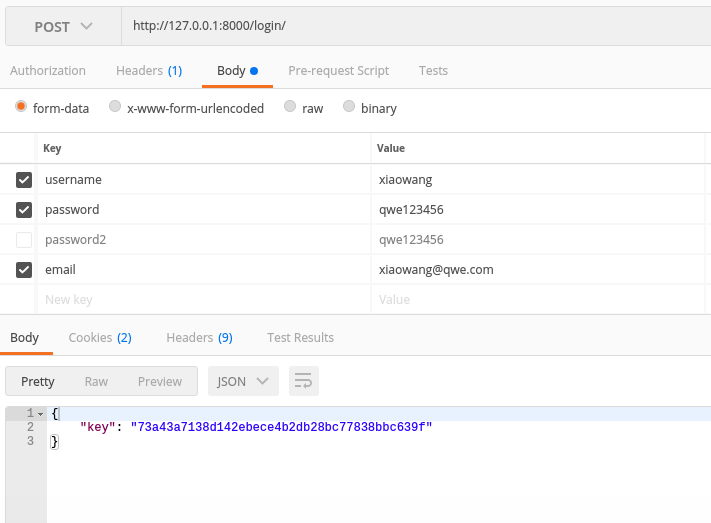

## simple-authentication 

------

simple-authentication 是以`django-allauth`与`Django`的`auth`模块为基础编写的一组包含 注册、登录、登出、密码重置、用户信息查询与更新 等功能的REST API。

------

## requirements

Python3.5

Django==1.11.15

django-allauth==0.35.0

djangorestframework==3.7.7

PyMySQL==0.8.0

------

## API endpoint

- /register/(POST)

  ​

  - username

  - password1

  - password2

  - email

    ​

- /register/verify-email/(POST)

  ​

  - key

    ​

- /login/(POST)

  ​

  - username

  - email

  - password

    ​

  - return  Token's key

  - example：

  - 

    ​

- /logout/(POST)

  ​

- /user/(GET、PUT、PATCH)

  ​

  - username

  - first_name

  - last_name

    ​

  - return  pk、username、email、first_name、last_name

  - example:

  - 

    ​

- /password/reset/(POST)

  ​

  - email

    ​

  - 后端将会给用户的邮箱发送密码重置邮件，该邮件包含uid 和 token

    ​

- /password/reset/confirm/(POST)

  ​

  - uid

  - token

  - new_password1

  - new_password2

    ​

- /password/change/(POST)

  ​

  - old_password
  - new_password1
  - new_password2

------

## Token's  key的生成方式

将用户对象序列化为json格式后，对其进行base64编码，然后与时间戳进行拼接出一个value；
将'salt'与'secret_key'拼接后进行sha1处理，与刚刚拼接的value进行哈希，将哈希结果与value进行拼接，即为key.

## 新用户注册与邮箱激活

用户填写注册信息进行注册后，服务后端将对传入的数据进行验证，如果该用户之前未注册过，则保存该用户信息，并给用户在注册时填写的邮箱发送一封激活邮件，该邮件包含一个’key'，用户点击激活链接后，该'key'将随用户的激活请求返回给服务后端，后端根据'key'找到对应的email地址，并激活该地址，该用户完成激活。

### 邮箱激活过程中的key

邮箱激活过程中，服务后端发送给用户的激活邮件中包含一个'key'值，用户点击激活链接后，该'key‘将会返回给后端。

key 是一串长度为64的随机字符串，具体请参考 django/utils/crypto.py中的`get_random_string`方法。
